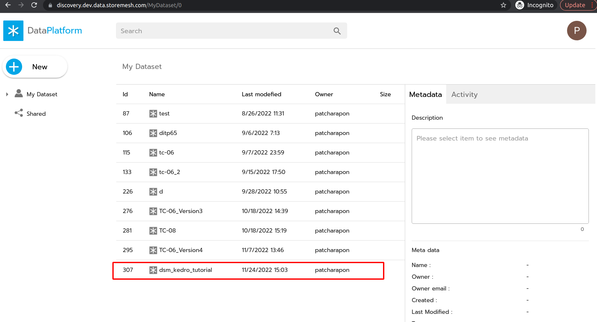

# DSM Kedro Tutorial
## Install and Setup
### Clone Source Code Template and dsm_kedro_plugin
1. copy Kedro Template for dsm to your desire directory and use it as workspace
```sh
cp -r ./dsm_kedro_template <your_working_directory>/dsm_kedro
cd  <your_working_directory>/dsm_kedro
```
2. init git (for generating logs later)
```sh
git init
git add .
git commit -m "first commit"
```
3. clone dsm_kedro_plugin as git-submodule
```sh
cd etl-pipeline/src
git submodule add https://gitlab.com/storemesh/project-template/data-engineer/kedro-template/dsm_kedro_plugin.git
```
after all above step, your project structure should be like this  


## Prepare Environment and Setting
1. go to kedro root project
```sh
cd .. # dsm_kedro/etl-pipeline
```
2. create conda env and activate

```sh
conda create -n kedro-<YOUR_PROJECT_NAME> python=3.8  
# press y
source activate kedro-<YOUR_PROJECT_NAME>
```

3. install require package
```sh
# at etl-pipeline/
pip install -r src/requirements.txt
```

4. (optional) create new ipython kernel 

```sh
python -m ipykernel install --user --name kedro-env-<YOUR_PROJECT_NAME> --display-name "Python (kedro-env-<YOUR_PROJECT_NAME>)"
```

5. create credentials file for using dsm library
```yml
# in conf/local/credentials.yml
dsmlibrary:
    token: "< YOUR JWT TOKEN >"
```

## Init Project in Data Platform
1. create your project as dataset in Data Discovery (`http://<YOUR_DISCOVERY_URL>`)


2. create project in `http://<YOUR_BACKEND_DISCOVERY_URL>/admin/logs/project/`


3. edit `project_setting.py`

    3.1. copy source and integration config template (do only first time)
    ```sh
    cp -R src/dsm_kedro_plugin/generate_datanode/config_template src/config
    ```
    after that, your project structure should be like this   
    

    3.2. go to `src/config/project_setting.py` and edit the following value   
    ```python
    PROJECT_NAME = "<YOUR_PROJECT_NAME>" # (It must be exactly the same value in Project Table of Data Discovery, use it for generate logs)  
    PROJECT_FOLDER_ID = <YOUR_PROJECT_FOLDER_ID> 
    DATAPLATFORM_API_URI = "<YOUR_DATAPLATFORM_API_URI>" # example: "https://api.discovery.dev.data.storemesh.com"
    OBJECT_STORAGE_URI = "<YOUR_OBJECT_STORAGE_URI>" # example: "dataframe.objectstorage.dev.data.storemesh.com"

    OBJECT_STORAGE_SECUE = <True or False> # use True if Object Storage connect with https
    ```

4. replace `src/config/config_source_table.py` with the your database connection and original table name, For example
    ```python
    source_table = {
        13: ['myapp_order', 'myapp_orderitem', 'myapp_item', 'myapp_payment'],
    }
    ```


5. create project template, generate SQL datanode, landing datanode and run landing pipeline in data platform
    ```sh
    sh src/dsm_kedro_plugin/generate_datanode/init_project_and_landing.sh
    ```
see result in your project folder of data discovery `http://<YOUR_DISCOVERY_URL>` 

**project template**


**landing files**


6. You can check and load your data catalog in Jupyter by following step in [Jupyter Section](./debug_delopment.md)

### If clone to new working directory
```
cd etl-pipeline/src/dsm_kedro_plugin
git submodule update --init --recursive
```