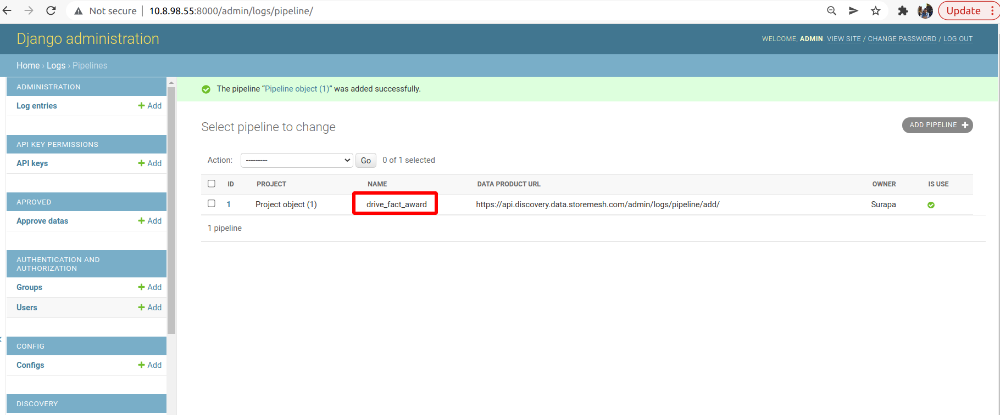

## Pipeline Logs Monitoring

1. add your pipeline in `http://<YOUR_DATA_PLATFROM_URL>/admin/logs/pipeline/`. Its name should be same as your pipeline name


2. define validation function and rules `config/validation_rules.py` 
```python
# config/validation_rules.py
...

ddf_fact_personentity = datanode.read_ddf(file_id=1917)

def in_fk_personentity(series):
    return series.isin(ddf_fact_personentity['id'].compute())

... 

rules = {
    ...
    4 : {
        'func':pa.Check(in_fk_personentity),
        'type': 'consistency',
    },
}
```

3. add it in your desire data catalog. For Example
```yml
s.drive_fact_award:
    type: dsm_kedro_plugin.custom_dataset.dsm_dataset.DsmDataNode
    project_folder_name: Staging
    file_name: drive_fact_award
    credentials: dsmlibrary
    schema: {
        'columns': {
            'personentity': { 'data_type': 'str', 'nullable': False, 'is_required': False, 'validation_rule': [4]},
        },
        'pk_column': 'id',
    }
```
4. run your pipeline with Logs runner.
```sh
kedro run --pipeline=<pipeline_name>  --runner=dsm_kedro_plugin.custom_runner.dsm_runner.WriteFullLogRunner
# Example: kedro run --pipeline=drive_fact_award  --runner=dsm_kedro_plugin.custom_runner.dsm_runner.WriteFullLogRunner
```

**Note:** if you want to debug and see validation log in local. You can do following step
- run pipeline without --runner.
```sh
kedro run --pipeline=<pipeline_name>
```
- open `logs/validation_logs/<folder_id>_<your_catalog_output_name>_write.csv` and see validation detail

5. open data dictionary of your file and click `open run pipeline`
6. see the detail and result of your pipeline