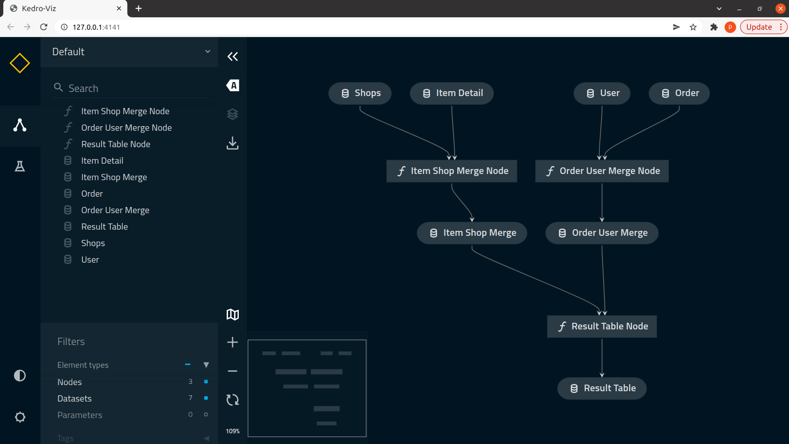

# Basic Kedro Tutorial
## Prepare Environment

1. create conda env and activate

    ```sh
    conda create -n kedro-environment python=3.8  
    # press y
    source activate kedro-environment
    ```

    **expected result:**
    ```sh
    (kedro-environment) patcharapon@patcharapon-Latitude-7420:~$
    ```
2. install kedro
    ```
    pip install kedro
    ```


3. create kedro project and type "basic_kedro" as kedro project name
    ```sh
    kedro new
    ```
    **expected result:**
    ```sh
    (kedro-environment2) patcharapon@patcharapon-Latitude-7420:~$ kedro new

    Project Name
    ============
    Please enter a human readable name for your new project.
    Spaces, hyphens, and underscores are allowed.
    [New Kedro Project]: basic_kedro 

    The project name 'basic_kedro' has been applied to: 
    - The project title in /home/patcharapon/basic-kedro/README.md 
    - The folder created for your project in /home/patcharapon/basic-kedro 
    - The project's python package in /home/patcharapon/basic-kedro/src/basic_kedro

    A best-practice setup includes initialising git and creating a virtual environment before running 'pip install -r src/requirements.txt' to install project-specific dependencies. Refer to the Kedro documentation: https://kedro.readthedocs.io/

    Change directory to the project generated in /home/patcharapon/basic-kedro by entering 'cd /home/patcharapon/basic-kedro'
    ```

4. add some library to `basic_kedro/src/requirements.txt`
    ```
    kedro-viz==5.1.1
    pandas==1.3.0
    ```

    **expected result:**
    ```sh
    # basic_kedro/src/requirements.txt
    black~=22.0
    flake8>=3.7.9, <5.0
    ipython>=7.31.1, <8.0
    isort~=5.0
    jupyter~=1.0
    jupyterlab~=3.0
    kedro~=0.18.3
    kedro-telemetry~=0.2.0
    nbstripout~=0.4
    pytest-cov~=3.0
    pytest-mock>=1.7.1, <2.0
    pytest~=6.2

    kedro-viz==5.1.1
    pandas==1.3.0
    ```

5. install required packages
    ```sh
    cd basic_kedro
    pip install -r src/requirements.txt
    ```
# Pipeline Detail


1. copy all files in https://drive.google.com/drive/folders/15vuEnHAWvAlRoddO9mhfe9zJbU99WtOP?usp=sharing and put it in to `data/01_raw`   
    **expected result:**
    ```
    basic_kedro
    ├── data
    │   ├── 01_raw
    │   │   └── order.csv
    │   │   └── item_detail.csv
    │   │   └── user.csv
    │   │   └── shops.csv
    │   ├── 02_intermediate
    │   └── ...

    ```


2. add catalog to `conf/base/catalog.yml`

    ```yml
    # conf/base/catalog.yml
    item_detail:
        type: pandas.CSVDataSet
        filepath: data/01_raw/item_detail.csv

    shops:
        type: pandas.CSVDataSet
        filepath: data/01_raw/shops.csv

    order:
        type: pandas.CSVDataSet
        filepath: data/01_raw/order.csv

    user:
        type: pandas.CSVDataSet
        filepath: data/01_raw/user.csv

    item_shop_merge:
        type: pandas.CSVDataSet
        filepath: data/02_intermediate/item_shop_merge.csv

    order_user_merge:
        type: pandas.CSVDataSet
        filepath: data/02_intermediate/order_user_merge.csv

    result_table:
        type: pandas.CSVDataSet
        filepath: data/03_primary/result_table.csv
    ```

3. test load catalog
    3.1 running this command and open jupyter notebook via http://localhost/8888/?token=<your_token>
    ```
    jupyter notebook
    ```
    3.2 create `read_catalog_example.ipynb` in `notebooks/`    
    3.3 put this in first cell and run to init kedro in jupyter (choose kernel "Python 3 (ipykernel)")
    ```python
    %load_ext kedro.extras.extensions.ipython
    ```

    **expected result:**
    ```python
    [11/23/22 14:44:43] WARNING  /home/patcharapon/miniconda3/envs/kedro-environment2/lib/python3.8/sit warnings.py:109
                             e-packages/kedro/extras/extensions/ipython.py:18: DeprecationWarning:                 
                             kedro.extras.extensions.ipython should be accessed only using the                     
                             alias kedro.ipython. The unaliased name will be removed in Kedro                      
                             0.19.0.                                                                               
                               warnings.warn(                                                                      
                                                                                                                   
                        INFO     Updated path to Kedro project: /home/patcharapon/basic-kedro            __init__.py:54
    [11/23/22 14:44:44] INFO     Kedro project basic_kedro                                               __init__.py:77
                        INFO     Defined global variable 'context', 'session', 'catalog' and 'pipelines' __init__.py:78
    [11/23/22 14:44:45] WARNING  /home/patcharapon/miniconda3/envs/kedro-environment2/lib/python3.8/sit warnings.py:109
                                e-packages/plotly/graph_objects/__init__.py:288: DeprecationWarning:                  
                                distutils Version classes are deprecated. Use packaging.version                       
                                instead.                                                                              
                                if LooseVersion(ipywidgets.__version__) >= LooseVersion("7.0.0"):                   
                                                                                                                    
                        INFO     Registered line magic 'run_viz'           
    ```
    3.4 list all available catalogs
    ```python
    catalog.list()
    ```
    **expected result:**:
    ```python
    [
        'item_detail',
        'shops',
        'order',
        'user',
        'item_shop_merge',
        'order_user_merge',
        'result_table',
        'parameters'
    ]
    ```
    3.5 load some catalog to explore data
    ```python
    df_item = catalog.load('item_detail')
    df_item
    ```

    **expected result:**
    ```python
    [11/23/22 14:50:43] INFO     Loading data from 'item_detail' (CSVDataSet)...                    data_catalog.py:343
    	id	name	    price	shop_id
    0	1	smartphone	8000	1
    1	2	laptop	    30000	1
    2	3	mouse	    200	    2
    ```

4. create pipeline   
in root of project (basic_kedro)
    ```sh
    kedro pipeline create merge_data
    # press N when it ask "Do you opt into usage analytics?  [y/N]:"
    ```

    **expected result:**
    ```python
    [11/23/22 14:55:30] WARNING  /home/patcharapon/miniconda3/envs/kedro-environment2/lib/python3.8/site-packages/jupyter_client/ warnings.py:109
                                connect.py:27: DeprecationWarning: Jupyter is migrating its paths to use standard platformdirs                  
                                given by the platformdirs library.  To remove this warning and                                                  
                                see the appropriate new directories, set the environment variable                                               
                                `JUPYTER_PLATFORM_DIRS=1` and then run `jupyter --paths`.                                                       
                                The use of platformdirs will be the default in `jupyter_core` v6                                                
                                from jupyter_core.paths import jupyter_data_dir                                                               
                                                                                                                                                
                        WARNING  /home/patcharapon/miniconda3/envs/kedro-environment2/lib/python3.8/site-packages/plotly/graph_ob warnings.py:109
                                jects/__init__.py:288: DeprecationWarning: distutils Version classes are deprecated. Use                        
                                packaging.version instead.                                                                                      
                                if LooseVersion(ipywidgets.__version__) >= LooseVersion("7.0.0"):                                             
                                                                                                                                                
    As an open-source project, we collect usage analytics. 
    We cannot see nor store information contained in a Kedro project. 
    You can find out more by reading our privacy notice: 
    https://github.com/kedro-org/kedro-plugins/tree/main/kedro-telemetry#privacy-notice 
    Do you opt into usage analytics?  [y/N]: N
    You have opted out of product usage analytics, so none will be collected.
    Creating the pipeline 'merge_data': OK
    Location: '/home/patcharapon/basic-kedro/src/basic_kedro/pipelines/merge_data'
    Creating '/home/patcharapon/basic-kedro/src/tests/pipelines/merge_data/test_pipeline.py': OK
    Creating '/home/patcharapon/basic-kedro/src/tests/pipelines/merge_data/__init__.py': OK
    Creating '/home/patcharapon/basic-kedro/conf/base/parameters': 
    Creating '/home/patcharapon/basic-kedro/conf/base/parameters/merge_data.yml': OK

    Pipeline 'merge_data' was successfully created.

    To be able to run the pipeline 'merge_data', you will need to add it to 'register_pipelines()' in '/home/patcharapon/basic-kedro/src/basic_kedro/pipeline_registry.py'.
    ```


5. replace all code in `src/basic_kedro/pipelines/merge_data/pipeline.py` with the below code

    ```python
    # src/basic_kedro/pipelines/merge_data/pipeline.py

    from kedro.pipeline import Pipeline, node, pipeline
    from .nodes import merge_item, merge_order, merge_all

    def create_pipeline(**kwargs) -> Pipeline:
        return pipeline(
            [
                node(
                    func=merge_item,
                    inputs=["item_detail", "shops"],
                    outputs="item_shop_merge",
                    name="item_shop_merge___node",
                ),
                node(
                    func=merge_order,
                    inputs=["order", "user"],
                    outputs="order_user_merge",
                    name="order_user_merge___node",
                ),
                node(
                    func=merge_all,
                    inputs=["item_shop_merge", "order_user_merge"],
                    outputs="result_table",
                    name="result_table___node",
                )
            ]
        )
    ```

6. replace all code in `src/basic_kedro/pipelines/merge_data/nodes.py` with the below code

    ```python
    # src/basic_kedro/pipelines/merge_data/nodes.py

    import pandas as pd

    def merge_item(df_item: pd.DataFrame, df_shops: pd.DataFrame) -> pd.DataFrame:
        df_shops = df_shops.rename(columns={'id':'shop_id', 'name': 'shop_name'})
        df_merge = df_item.merge(df_shops, on='shop_id')
        return df_merge

    def merge_order(df_order: pd.DataFrame, df_user: pd.DataFrame) -> pd.DataFrame:
        df_user = df_user.rename(columns={'id':'user_id', 'name': 'user_name'})
        df_merge = df_order.merge(df_user, on='user_id')
        return df_merge

    def merge_all(df_item_shop: pd.DataFrame, df_order_user: pd.DataFrame) -> pd.DataFrame:
        """Merge item_shop and order_user for result table

        Args:
            df_item_shop (pd.DataFrame, required): dataframe of item and shop.
            df_order_user (pd.DataFrame, required): dataframe of order and user.
            
        Returns:
            pd.DataFrame: result of merge
        """
        df_item_shop = df_item_shop.rename(columns={'id':'item_id', 'name': 'item_name'})
        df_merge = df_order_user.merge(df_item_shop, on='item_id')
        return df_merge
    ```

7. replace all code in `src/basic_kedro/pipelines/pipeline_registry.py` with the below code
    ```python

    from typing import Dict

    from kedro.pipeline import Pipeline
    from basic_kedro.pipelines.merge_data import pipeline as md 

    def register_pipelines() -> Dict[str, Pipeline]:
        """Register the project's pipelines.

        Returns:
            A mapping from pipeline names to ``Pipeline`` objects.
        """
        merge_data_pipeline = md.create_pipeline()

        return {
            "__default__": merge_data_pipeline,
            "merge_data": merge_data_pipeline,
        }
    ```

8. visualize your data pipeline with kedro-viz
    ```sh
    kedro viz
    ```
    and open http://127.0.0.1:4141/, you should see the pipeline visualization as below


9. test your pipeline by running specific node 
    ```sh
    kedro run --pipeline=merge_data --node=item_shop_merge___node
    ```

    **expected result:**
    ```python
    [11/23/22 15:10:44] WARNING  /home/patcharapon/miniconda3/envs/kedro-environment2/lib/python3.8/site-packages/jupyter_client/ warnings.py:109
                                connect.py:27: DeprecationWarning: Jupyter is migrating its paths to use standard platformdirs                  
                                given by the platformdirs library.  To remove this warning and                                                  
                                see the appropriate new directories, set the environment variable                                               
                                `JUPYTER_PLATFORM_DIRS=1` and then run `jupyter --paths`.                                                       
                                The use of platformdirs will be the default in `jupyter_core` v6                                                
                                from jupyter_core.paths import jupyter_data_dir                                                               
                                                                                                                                                
                        WARNING  /home/patcharapon/miniconda3/envs/kedro-environment2/lib/python3.8/site-packages/plotly/graph_ob warnings.py:109
                                jects/__init__.py:288: DeprecationWarning: distutils Version classes are deprecated. Use                        
                                packaging.version instead.                                                                                      
                                if LooseVersion(ipywidgets.__version__) >= LooseVersion("7.0.0"):                                             
                                                                                                                                                
    [11/23/22 15:10:44] INFO     Kedro project basic-kedro                                                                         session.py:343
    [11/23/22 15:10:45] INFO     Loading data from 'item_detail' (CSVDataSet)...                                              data_catalog.py:343
                        INFO     Loading data from 'shops' (CSVDataSet)...                                                    data_catalog.py:343
                        INFO     Running node: item_shop_merge___node: merge_item([item_detail,shops]) -> [item_shop_merge]           node.py:327
                        INFO     Saving data to 'item_shop_merge' (CSVDataSet)...                                             data_catalog.py:382
                        INFO     Completed 1 out of 1 tasks                                                               sequential_runner.py:85
                        INFO     Pipeline execution completed successfully.                                                          runner.py:90
    ```

    and check in `data/02_intermediate/`, you must see `item_shop_merge.csv` are generated.

10. run all pipeline
    ```sh
    kedro run --pipeline=merge_data
    ```

    **expected results:**
    ```python
    [11/23/22 15:49:39] WARNING  /home/patcharapon/miniconda3/envs/kedro-environment2/lib/python3.8/site-packages/jupyter_client/ warnings.py:109
                                connect.py:27: DeprecationWarning: Jupyter is migrating its paths to use standard platformdirs                  
                                given by the platformdirs library.  To remove this warning and                                                  
                                see the appropriate new directories, set the environment variable                                               
                                `JUPYTER_PLATFORM_DIRS=1` and then run `jupyter --paths`.                                                       
                                The use of platformdirs will be the default in `jupyter_core` v6                                                
                                from jupyter_core.paths import jupyter_data_dir                                                               
                                                                                                                                                
                        WARNING  /home/patcharapon/miniconda3/envs/kedro-environment2/lib/python3.8/site-packages/plotly/graph_ob warnings.py:109
                                jects/__init__.py:288: DeprecationWarning: distutils Version classes are deprecated. Use                        
                                packaging.version instead.                                                                                      
                                if LooseVersion(ipywidgets.__version__) >= LooseVersion("7.0.0"):                                             
                                                                                                                                                
    [11/23/22 15:49:39] INFO     Kedro project basic-kedro                                                                         session.py:343
    [11/23/22 15:49:40] INFO     Loading data from 'item_detail' (CSVDataSet)...                                              data_catalog.py:343
    [11/23/22 15:49:41] INFO     Loading data from 'shops' (CSVDataSet)...                                                    data_catalog.py:343
                        INFO     Running node: item_shop_merge___node: merge_item([item_detail,shops]) -> [item_shop_merge]           node.py:327
                        INFO     Saving data to 'item_shop_merge' (CSVDataSet)...                                             data_catalog.py:382
                        INFO     Completed 1 out of 3 tasks                                                               sequential_runner.py:85
                        INFO     Loading data from 'order' (CSVDataSet)...                                                    data_catalog.py:343
                        INFO     Loading data from 'user' (CSVDataSet)...                                                     data_catalog.py:343
                        INFO     Running node: order_user_merge___node: merge_order([order,user]) -> [order_user_merge]               node.py:327
                        INFO     Saving data to 'order_user_merge' (CSVDataSet)...                                            data_catalog.py:382
                        INFO     Completed 2 out of 3 tasks                                                               sequential_runner.py:85
                        INFO     Loading data from 'item_shop_merge' (CSVDataSet)...                                          data_catalog.py:343
                        INFO     Loading data from 'order_user_merge' (CSVDataSet)...                                         data_catalog.py:343
                        INFO     Running node: result_table___node: merge_all([item_shop_merge,order_user_merge]) -> [result_table]   node.py:327
                        INFO     Saving data to 'result_table' (CSVDataSet)...                                                data_catalog.py:382
                        INFO     Completed 3 out of 3 tasks                                                               sequential_runner.py:85
                        INFO     Pipeline execution completed successfully.                                                          runner.py:90
    ```
    check in `data/03_primary/`, you must see `result_table.csv` are generated.


11. check result in jupyter
    ```python
    df_result = catalog.load('result_table')
    print(df_result)
    ```

    **expected results:**
    ```python
    [11/23/22 15:53:45] INFO     Loading data from 'result_table' (CSVDataSet)...                   data_catalog.py:343
    id  item_id  user_id user_name   item_name  price  shop_id shop_name
    0   1        1        1      john  smartphone   8000        1     shopA
    1   2        2        1      john      laptop  30000        1     shopA
    2   3        3        2     david       mouse    200        2     shopB
    ```

12. build Sphinx document
```sh
kedro build-docs
```

To see document, open `docs/build/html/index.html` in browser

12. Finish!!