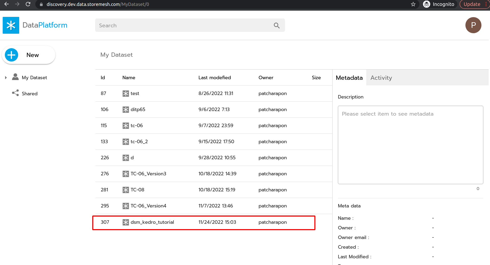
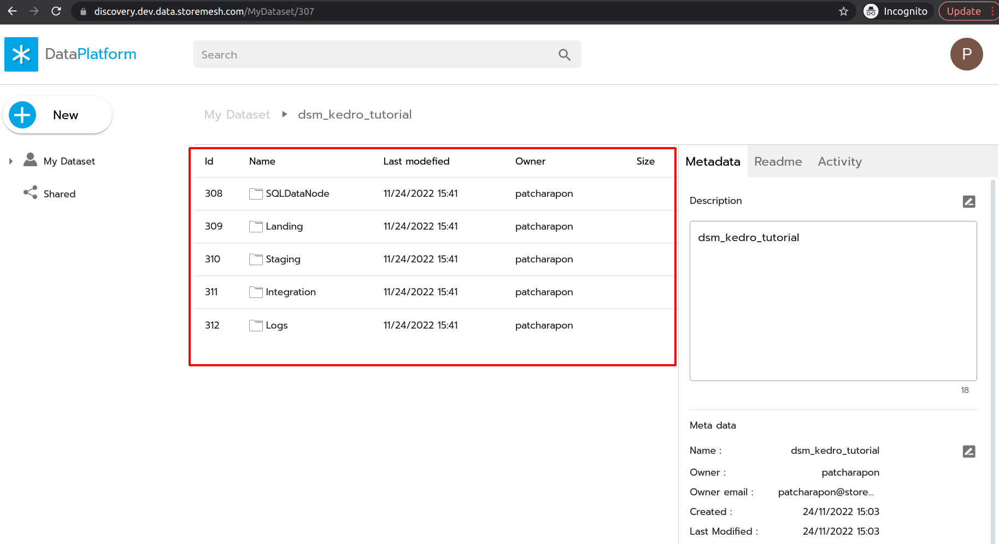
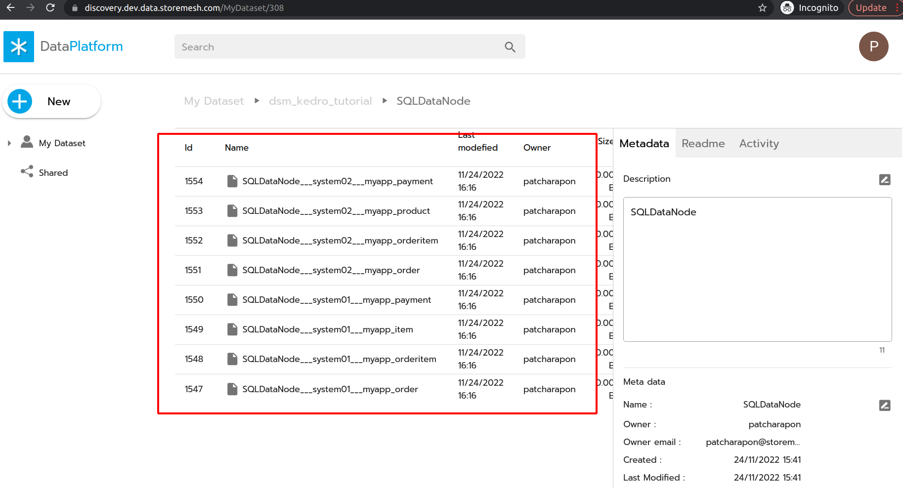
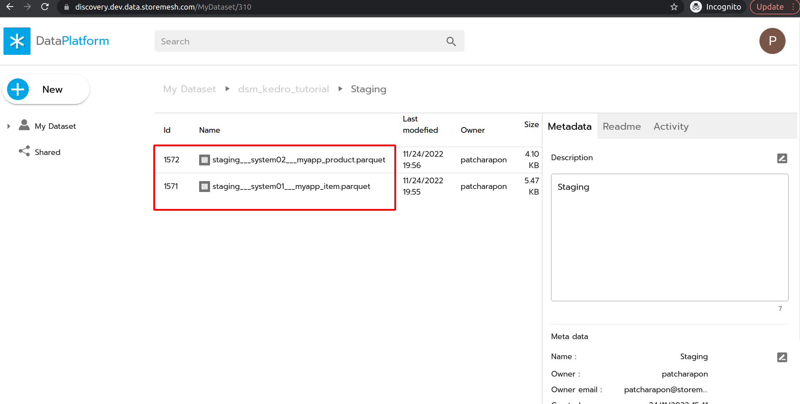
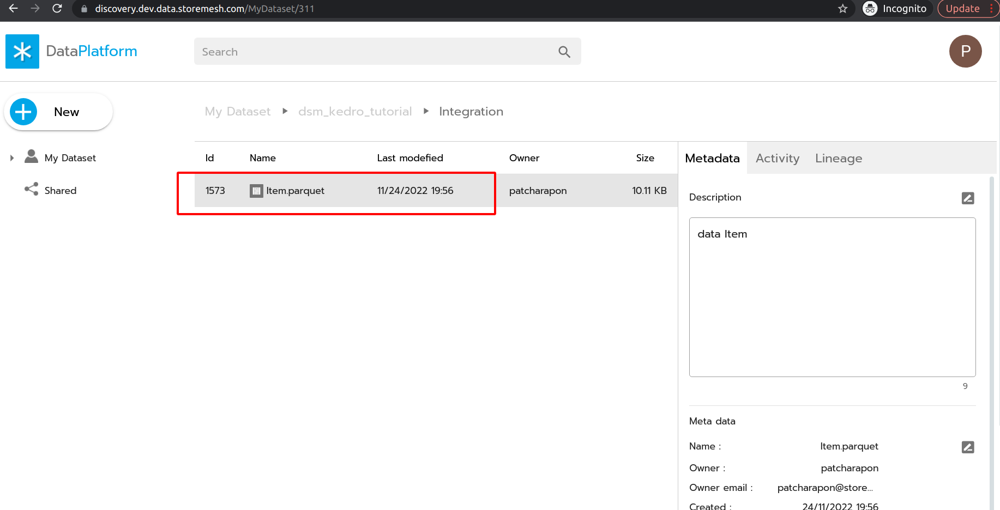
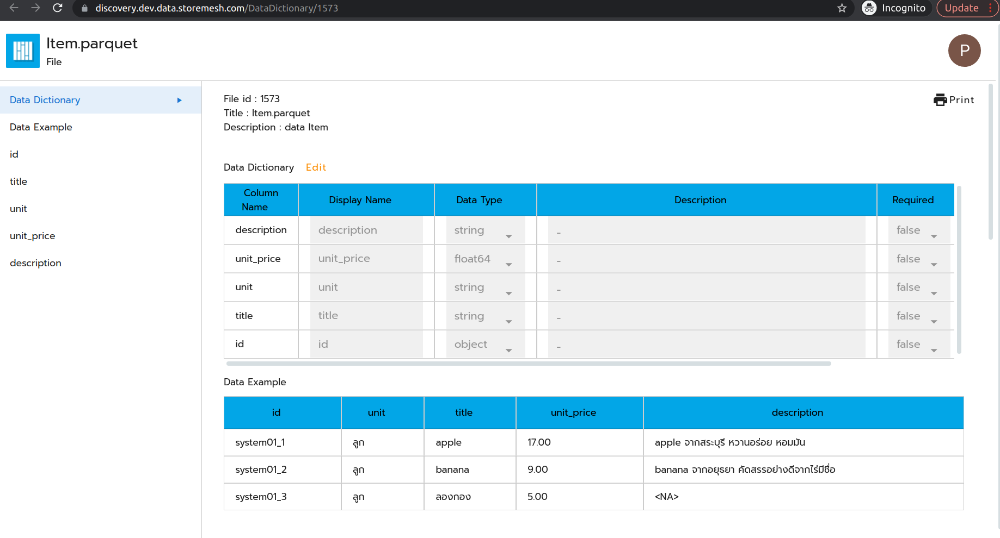
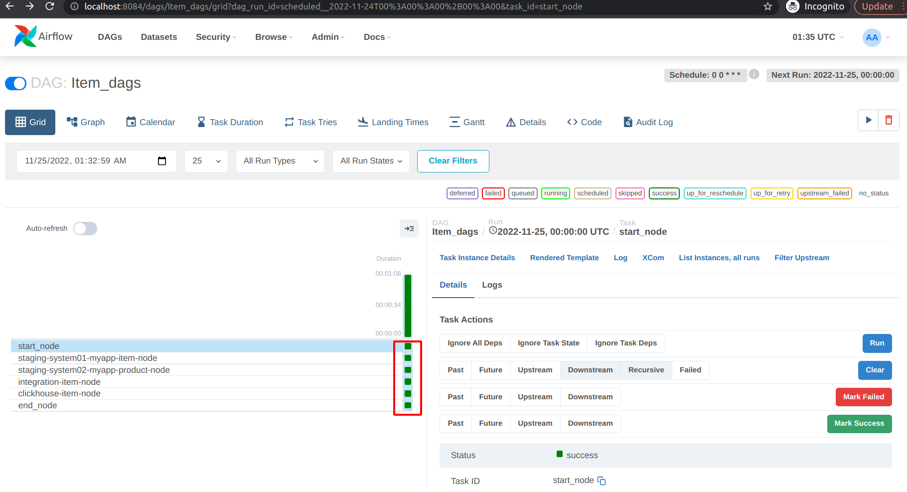

# DSM Kedro Tutorial
## Install and Setup
### Clone Source Code Template
1. copy Kedro Template for dsm to your desire directory and use it as workspace
```sh
cp ../dsm_kedro_template <your_working_directory>/dsm_kedro_template
cd <your_working_directory>/dsm_kedro_template
```
2. init git (for generating logs later)
```sh
git init
git add .
git commit -m "first commit"
```

3. clone dsm_kedro_plugin
```sh
cd dsm_kedro/etl-pipeline/src/dsm_kedro_plugin
git submodule init
git submodule update
```

## Prepare Environment and Setting
1. go to kedro root project
```
cd dsm_kedro/etl-pipeline
```
2. create conda env and activate

```sh
conda create -n kedro-environment python=3.8  
# press y
source activate kedro-environment
```

3. install require package
```sh
# at etl-pipeline/
pip install -r src/requirements.txt
```

4. create new ipython kernel

```sh
python -m ipykernel install --user --name kedro-env --display-name "Python (kedro-env)"
```

5. create credentials file for using dsm library
```yml
# in conf/local/credentials.yml
dsmlibrary:
    token: "< YOUR JWT TOKEN >"
```

## Data Generator Roles Works
0. create your project as dataset `dsm_kedro_tutorial` in Data Discovery https://discovery.dev.data.storemesh.com/ 


1. create project template in Data Discovery from `project folder id`

    1.1. copy source and integration config template (do only first time)
    ```sh
    cp -R src/dsm_kedro_plugin/generate_datanode/config_template src/config
    ```

    1.2. go to `src/config/project_setting.py` and put the following value   
        - PROJECT_NAME: `dsm_kedro_tutorial` (It must be exactly the same value in Project Table of Data Discovery, use it for generate logs)  
        - PROJECT_FOLDER_ID: `<your_project_folder_id>`

    1.3. create project template in Data Discovery by running this script
    ```sh
    python src/dsm_kedro_plugin/create_project_template.py
    ```
    **expected result:**
    
    Check in your project folder Data Discovery, you will see the following folder 
        - SQLDataNode
        - Landing
        - Staging
        - Integration
        - Logs   
        
    
2. create SQLDataNode and Landing Zone (if you have database as data source) 

    2.1. replace `src/config/config_source_table.py` with the code below
    ```python
    source_table = {
        3: ['myapp_order', 'myapp_orderitem', 'myapp_item', 'myapp_payment'],
        4: ['myapp_order', 'myapp_orderitem', 'myapp_product', 'myapp_payment'],
    }
    ```
   
    
    2.2. generate sql_datanode (auto write SQLDataNode to data platform)
    ```sh
    python src/dsm_kedro_plugin/generate_datanode/01_generate_sql_datanode.py
    ```
    **expected result:**  
    ```python
    Init DataNode sucessful!
    Init DataNode sucessful!
    --- dabase id: 3 ----- 
    profile: Neither 'InstrumentedAttribute' object nor 'Comparator' object associated with MyappOrder.profile has an attribute 'primary_key'
    myapp_orderitem: Neither 'InstrumentedAttribute' object nor 'Comparator' object associated with MyappOrder.myapp_orderitem has an attribute 'primary_key'
    myapp_payment: Neither 'InstrumentedAttribute' object nor 'Comparator' object associated with MyappOrder.myapp_payment has an attribute 'primary_key'
    item: Neither 'InstrumentedAttribute' object nor 'Comparator' object associated with MyappOrderitem.item has an attribute 'primary_key'
    order: Neither 'InstrumentedAttribute' object nor 'Comparator' object associated with MyappOrderitem.order has an attribute 'primary_key'
    myapp_orderitem: Neither 'InstrumentedAttribute' object nor 'Comparator' object associated with MyappItem.myapp_orderitem has an attribute 'primary_key'
    order: Neither 'InstrumentedAttribute' object nor 'Comparator' object associated with MyappPayment.order has an attribute 'primary_key'
    --- dabase id: 4 ----- 
    profile: Neither 'InstrumentedAttribute' object nor 'Comparator' object associated with MyappOrder.profile has an attribute 'primary_key'
    myapp_orderitem: Neither 'InstrumentedAttribute' object nor 'Comparator' object associated with MyappOrder.myapp_orderitem has an attribute 'primary_key'
    myapp_payment: Neither 'InstrumentedAttribute' object nor 'Comparator' object associated with MyappOrder.myapp_payment has an attribute 'primary_key'
    order: Neither 'InstrumentedAttribute' object nor 'Comparator' object associated with MyappOrderitem.order has an attribute 'primary_key'
    product: Neither 'InstrumentedAttribute' object nor 'Comparator' object associated with MyappOrderitem.product has an attribute 'primary_key'
    myapp_orderitem: Neither 'InstrumentedAttribute' object nor 'Comparator' object associated with MyappProduct.myapp_orderitem has an attribute 'primary_key'
    order: Neither 'InstrumentedAttribute' object nor 'Comparator' object associated with MyappPayment.order has an attribute 'primary_key'

    generate sql datanode is successful!!
    ```
    This will generate the following files
    - `conf/base/catalogs/generate/catalog_01_sql_datanode.yml`
    - sql datanode files in your `SQLDataNode` folder (in Data Discovery)
    


    2.4. generate landing catalogs, nodes and pipelines file
    ```sh
    python src/dsm_kedro_plugin/generate_datanode/02_generate_landing.py
    ```
    **expected result:**
    ```python
    Init DataNode sucessful!
    Init DataNode sucessful!
    landing___system01___myapp_order
    landing___system01___myapp_orderitem
    landing___system01___myapp_item
    landing___system01___myapp_payment
    landing___system02___myapp_order
    landing___system02___myapp_orderitem
    landing___system02___myapp_product
    landing___system02___myapp_payment

    generate landing is successful!!
    ```
    This will generate the following files
    - `conf/base/catalogs/generate/catalog_02_landing.yml`
    - `src/etl_pipeline/pipelines/query_landing/nodes.py`
    - `src/etl_pipeline/pipelines/query_landing/pipeline.py`

3. create Data Catalog for Integration Zone  

    run this command to generate integration catalogs
    ```sh
    python src/dsm_kedro_plugin/generate_datanode/03_generate_integration.py
    # set APPEND_MODE to True, if you want to write file in append mode and partition on query date
    ```
    **expected result:**
    ```
    Init DataNode sucessful!

    generate integration is successful!!
    ```
    This will generate the following files
    - `conf/base/catalogs/generate/catalog_03_integration.yml`

4. replace `src/etl_pipeline/pipeline_registry.py` with the code below

    ```python
    # src/etl_pipeline/pipeline_registry.py
    from typing import Dict

    import sys
    import os
    sys.path.append(os.getcwd())

    from kedro.framework.project import find_pipelines
    from kedro.pipeline import Pipeline, pipeline
    from src.etl_pipeline.pipelines.query_landing import pipeline as query_landing_obj
    from src.etl_pipeline.pipelines.Item import pipeline as Item_obj
    from src.etl_pipeline.pipelines.OrderItem import pipeline as OrderItem_obj
    from src.etl_pipeline.pipelines.Order import pipeline as Order_obj
    from src.etl_pipeline.pipelines.Payment import pipeline as Payment_obj

    def register_pipelines() -> Dict[str, Pipeline]:
        """Register the project's pipelines.

        Returns:
            A mapping from pipeline names to ``Pipeline`` objects.
        """
        query_landing_pipeline = query_landing_obj.create_pipeline()
        item_pipeline = Item_obj.create_pipeline()
        orderItem_pipeline = OrderItem_obj.create_pipeline()
        order_pipeline = Order_obj.create_pipeline()
        payment_pipeline = Payment_obj.create_pipeline()

        return {
            "__default__": pipeline([]),
            "query_landing": query_landing_pipeline,
            "Item": item_pipeline,
            "OrderItem": orderItem_pipeline,
            "Order": order_pipeline,
            "Payment": payment_pipeline,
        }
    ```


5. generate Landing Data to Landing Zone

    run query landing pipeline
    ```sh
    kedro run --pipeline=query_landing
    ```

    **Note:** To run landing in specific source, check `your_node_name` in `src/etl_pipeline/pipelines/query_landing/pipeline.py`, copy and run this command
    ```sh
    kedro run --pipeline=query_landing --node=<your_node_name>
    ```

    **expected result:**
    ```python
    ial/02_dsm_kedro/dsm_kedro/etl-pipeline$ kedro run --pipeline=query_landing
    [11/24/22 17:12:19] INFO     Kedro project etl-pipeline                                            session.py:343
    [11/24/22 17:12:20] INFO     Loading data from 'SQLDataNode___system01___myapp_item'          data_catalog.py:343
                                (DsmSQLDataNode)...                                                                 
    Init DataNode sucessful!
    Init DataNode sucessful!
    [11/24/22 17:12:22] INFO     Running node: landing___system01___myapp_item___node:                    node.py:327
                                pass_data([SQLDataNode___system01___myapp_item]) ->                                 
                                [landing___system01___myapp_item]                                                   
                        INFO     Saving data to 'landing___system01___myapp_item'                 data_catalog.py:382
                                (DsmListDataNode)...                                                                
    Init DataNode sucessful!
    [########################################] | 100% Completed | 402.24 ms
    [11/24/22 17:12:36] INFO     Completed 1 out of 8 tasks                                   sequential_runner.py:85
                              

    ....

    [11/24/22 17:14:16] INFO     Running node: landing___system02___myapp_product___node:                 node.py:327
                                pass_data([SQLDataNode___system02___myapp_product]) ->                              
                                [landing___system02___myapp_product]                                                
                        INFO     Saving data to 'landing___system02___myapp_product'              data_catalog.py:382
                                (DsmListDataNode)...                                                                
    Init DataNode sucessful!
    [########################################] | 100% Completed | 402.72 ms
    [11/24/22 17:14:31] INFO     Completed 8 out of 8 tasks                                   sequential_runner.py:85
                        INFO     Pipeline execution completed successfully.                              runner.py:90
    ```

    see more detail in : [data generator guideline](dsm_kedro/_docs/data_generator_role.md)

## Data Engineer Roles Works (create Item pipeline)
1. create Item pipeline in kedro
    ```sh
    kedro pipeline create Item
    ```
    
2. create staging catalog file for Item pipeline at `conf/base/catalogs/manual/integration_Item.yml` (change clickhouse tablename to `Item___<YOUR_NAME>`, For example: `Item___patcharapon`)
```yml
# conf/base/catalogs/manual/integration_Item.yml

# system01
staging___system01___myapp_item:
    type: dsm_kedro_plugin.custom_dataset.dsm_dataset.DsmDataNode
    project_folder_name: Staging
    file_name: staging___system01___myapp_item
    credentials: dsmlibrary

# system02
staging___system02___myapp_product:
    type: dsm_kedro_plugin.custom_dataset.dsm_dataset.DsmDataNode
    project_folder_name: Staging
    file_name: staging___system02___myapp_product
    credentials: dsmlibrary

# clickhouse
clickhouse___Item:
    type: dsm_kedro_plugin.custom_dataset.clickhouse_dataset.ClickHouseDataset
    table_name: Item___<YOUR_NAME>
    partitioned_column: id 
    credentials: clickhouse
    if_exist: drop 
```

3. replace `src/etl_pipeline/pipelines/Item/pipeline.py` with the code below

```python
# src/etl_pipeline/pipelines/Item/pipeline.py

from kedro.pipeline import Pipeline, node, pipeline
from .nodes import merge_item, staging_app1, staging_app2, to_clickhouse

def create_pipeline(**kwargs) -> Pipeline:
    return pipeline(
        [
            # staging
            # app 1
            node(
                func=staging_app1,
                inputs="landing___system01___myapp_item",
                outputs="staging___system01___myapp_item",
                name="staging___system01___myapp_item____node",
            ),

            # app 2
            node(
                func=staging_app2,
                inputs="landing___system02___myapp_product",
                outputs="staging___system02___myapp_product",
                name="staging___system02___myapp_product___node",
            ),
            
            # integration
            node(
                func=merge_item,
                inputs=dict(
                    data_app1="staging___system01___myapp_item", 
                    data_app2="staging___system02___myapp_product",
                ),
                outputs="integration___Item",
                name="integration___Item___node",
            ),

            # clickhouse
            node(
                func=to_clickhouse,
                inputs="integration___Item", 
                outputs="clickhouse___Item",
                name="clickhouse___Item___node",
            ),

        ]
    )
```

4. replace `src/etl_pipeline/pipelines/Item/nodes.py`  with the code below
```python
# src/etl_pipeline/pipelines/Item/nodes.py

import dask.dataframe as dd
from typing import List, Tuple

def staging_app1(data: Tuple[dd.DataFrame, int]) -> Tuple[dd.DataFrame, List[int]]:
    ddf, file_id = data
    ddf = ddf.reset_index()
    ddf['id'] = 'system01' + '_' + ddf['id'].astype(str) 
    lineage_id = [file_id]
    return (ddf, lineage_id)

def staging_app2(data: Tuple[dd.DataFrame, int]) -> Tuple[dd.DataFrame, List[int]]:
    ddf, file_id = data
    ddf = ddf.reset_index()
    ddf['id'] = 'system02' + '_' + ddf['id'].astype(str) 
    lineage_id = [file_id]
    return (ddf, lineage_id)

def merge_item(
        data_app1: Tuple[dd.DataFrame, int],
        data_app2: Tuple[dd.DataFrame, int],
    ):
    ddf_app1, app1_fid = data_app1
    ddf_app2, app2_fid = data_app2

    all_merge = dd.concat([ddf_app1, ddf_app2])
    all_merge['id'] = all_merge['id'].astype('string')

    lineage_id = [app1_fid, app2_fid]
    return (all_merge, lineage_id)


def to_clickhouse(data: Tuple[dd.DataFrame, int]):
    ddf, file_id = data
    return ddf
```

5. replace `src/etl_pipeline/pipeline_registry.py` with the code below   
    ```python
    # src/etl_pipeline/pipeline_registry.py

    from typing import Dict

    import sys
    import os
    sys.path.append(os.getcwd())

    from kedro.framework.project import find_pipelines
    from kedro.pipeline import Pipeline, pipeline
    from src.etl_pipeline.pipelines.query_landing import pipeline as query_landing_obj
    from src.etl_pipeline.pipelines.Item import pipeline as Item_obj

    def register_pipelines() -> Dict[str, Pipeline]:
        """Register the project's pipelines.

        Returns:
            A mapping from pipeline names to ``Pipeline`` objects.
        """
        query_landing_pipeline = query_landing_obj.create_pipeline()
        item_pipeline = Item_obj.create_pipeline()

        return {
            "__default__": pipeline([]),
            "query_landing": query_landing_pipeline,
            "Item": item_pipeline,
        }
    ```

6. run your pipeline 

    6.1 run all node in Item pipeline
    ```sh
    kedro run --pipeline=Item --to-nodes=integration___Item___node
    ```

    **expected result:**
    ```python
    [11/24/22 19:55:46] WARNING  /home/patcharapon/miniconda3/envs/kedro-environment3/lib/python3.8/site-p warnings.py:109
                                ackages/jupyter_client/connect.py:27: DeprecationWarning: Jupyter is                     
                                migrating its paths to use standard platformdirs                                         
                                given by the platformdirs library.  To remove this warning and                           
                                see the appropriate new directories, set the environment variable                        
                                `JUPYTER_PLATFORM_DIRS=1` and then run `jupyter --paths`.                                
                                The use of platformdirs will be the default in `jupyter_core` v6                         
                                from jupyter_core.paths import jupyter_data_dir                                        
                                                                                                                        
                        WARNING  /home/patcharapon/miniconda3/envs/kedro-environment3/lib/python3.8/site-p warnings.py:109
                                ackages/plotly/graph_objects/__init__.py:288: DeprecationWarning:                        
                                distutils Version classes are deprecated. Use packaging.version instead.                 
                                if LooseVersion(ipywidgets.__version__) >= LooseVersion("7.0.0"):                      
                                                                                                                        
    [11/24/22 19:55:46] INFO     Kedro project etl-pipeline                                                 session.py:343
    [11/24/22 19:55:49] INFO     Loading data from 'landing___system01___myapp_item'                   data_catalog.py:343
                                (DsmListDataNode)...                                                                     
    Init DataNode sucessful!
    version_file_id : {'file_id': 1555, 'timestamp': '2022/11/24 17:12:31'}
    list_datanode is out of range for index 1
    [11/24/22 19:55:50] INFO     Running node: staging___system01___myapp_item____node:                        node.py:327
                                staging_app1([landing___system01___myapp_item]) ->                                       
                                [staging___system01___myapp_item]                                                        
                        INFO     Saving data to 'staging___system01___myapp_item' (DsmDataNode)...     data_catalog.py:382
    Init DataNode sucessful!
    [########################################] | 100% Completed | 200.76 ms
    [11/24/22 19:56:00] INFO     Completed 1 out of 3 tasks                                        sequential_runner.py:85
                        INFO     Loading data from 'landing___system02___myapp_product'                data_catalog.py:343
                                (DsmListDataNode)...                                                                     
    Init DataNode sucessful!
    version_file_id : {'file_id': 1569, 'timestamp': '2022/11/24 17:14:26'}
    list_datanode is out of range for index 1
    [11/24/22 19:56:01] INFO     Running node: staging___system02___myapp_product___node:                      node.py:327
                                staging_app2([landing___system02___myapp_product]) ->                                    
                                [staging___system02___myapp_product]                                                     
                        INFO     Saving data to 'staging___system02___myapp_product' (DsmDataNode)...  data_catalog.py:382
    Init DataNode sucessful!
    [########################################] | 100% Completed | 200.68 ms
    [11/24/22 19:56:11] INFO     Completed 2 out of 3 tasks                                        sequential_runner.py:85
                        INFO     Loading data from 'staging___system01___myapp_item' (DsmDataNode)...  data_catalog.py:343
    Init DataNode sucessful!
    [11/24/22 19:56:12] INFO     Loading data from 'staging___system02___myapp_product'                data_catalog.py:343
                                (DsmDataNode)...                                                                         
    Init DataNode sucessful!
                        INFO     Running node: integration___Item___node:                                      node.py:327
                                merge_item([staging___system01___myapp_item,staging___system02___myapp_produc            
                                t]) -> [integration___Item]                                                              
                        INFO     Saving data to 'integration___Item' (DsmDataNode)...                  data_catalog.py:382
    Init DataNode sucessful!
    [########################################] | 100% Completed | 603.71 ms
    [11/24/22 19:56:20] INFO     Completed 3 out of 3 tasks                                        sequential_runner.py:85
                        INFO     Pipeline execution completed successfully.                                   runner.py:90
    ```

    Staging Output
    

    Integration Output
    

    Data Dictionary
    

    6.2 run all node in Item pipeline (also to clickhouse) with Validation Logs
    ```sh
    kedro run --pipeline=Item --runner=dsm_kedro_plugin.custom_runner.dsm_runner.WriteFullLogRunner
    ```

    see more detail in : [data engineer guideline](dsm_kedro/_docs/data_engineer_role.md)

# Run pipeline in Airflow

1. generate airflow dags 
```sh
# at etl-pipeline/
kedro airflow create --target-dir=airflow_dags/  --pipeline=Item
```
2. rename `etl_pipeline_dag.py` to `Item_dags.py`
3. edit schedule and add other config in `airflow_dags/Item_dags` as follow
    - specific runner to generate run logs
    ```python
    ...    
    import sys
    import os
    sys.path.append(os.getcwd())

    from airflow.operators.python_operator import PythonOperator
    from kedro.framework.startup import bootstrap_project
    from src.dsm_kedro_plugin.custom_runner.dsm_runner import WriteFunctionLogRunner
    from src.dsm_kedro_plugin.custom_runner.utils.logs_generator import gen_log_start, gen_log_finish
    ...

    class KedroOperator(BaseOperator):
        ...
        # replace execute method with this
        def execute(self, context):
            bootstrap_project(project_path)
            with KedroSession.create(self.project_path, env=self.env) as session:
                session.run(
                    self.pipeline_name,
                    node_names=[self.node_name],
                    runner=WriteFunctionLogRunner(),
                )
    ```
    - change schedule to your desire crons expression
    ```python
        with DAG(
            "<YOUR_DAGS_NAME>",
            ...
            # 'retries': 1,  # disable retry
            # 'retry_delay': timedelta(minutes=5)
            schedule_interval="0 0 * * *",  # see more https://airflow.apache.org/docs/stable/scheduler, https://crontab.guru/
            ...
        ) as dag:
    ```
    - add `start_node` and `end_node` to generate log
    ```python
    ...
    tasks= {}

    tasks['start_node'] = PythonOperator(
        task_id='start_node', 
        python_callable=gen_log_start, 
        op_kwargs={'pipeline_name': pipeline_name},
    )

    tasks['end_node'] = PythonOperator(
        task_id='end_node', 
        python_callable=gen_log_finish, 
        op_kwargs={'pipeline_name': pipeline_name},
    )
    ...

    tasks["start_node"] >> tasks["staging-system01-myapp-item-node"]

    ...

    tasks["clickhouse-item-node"] >> tasks["end_node"]
    ```

    **expected result:**

    complete code of `airflow_dags/Item_dags.py`
```python
# airflow_dags/Item_dags.py

from collections import defaultdict

from pathlib import Path

from airflow import DAG
from airflow.models import BaseOperator
from airflow.utils.decorators import apply_defaults
from airflow.version import version
from datetime import datetime, timedelta

from kedro.framework.session import KedroSession
from kedro.framework.project import configure_project

import sys
import os
sys.path.append(os.getcwd())

from airflow.operators.python_operator import PythonOperator
from kedro.framework.startup import bootstrap_project
from src.dsm_kedro_plugin.custom_runner.dsm_runner import WriteFunctionLogRunner
from src.dsm_kedro_plugin.custom_runner.utils.logs_generator import gen_log_start, gen_log_finish


class KedroOperator(BaseOperator):

    @apply_defaults
    def __init__(
        self,
        package_name: str,
        pipeline_name: str,
        node_name: str,
        project_path: str,
        env: str,
        *args, **kwargs
    ) -> None:
        super().__init__(*args, **kwargs)
        self.package_name = package_name
        self.pipeline_name = pipeline_name
        self.node_name = node_name
        self.project_path = project_path
        self.env = env

    # replace execute method with this
    def execute(self, context):
        bootstrap_project(project_path)
        with KedroSession.create(self.project_path, env=self.env) as session:
            session.run(
                self.pipeline_name,
                node_names=[self.node_name],
                runner=WriteFunctionLogRunner(),
            )

# Kedro settings required to run your pipeline
env = "local"
pipeline_name = "Item"
project_path = Path.cwd()
package_name = "etl_pipeline"

# Default settings applied to all tasks
default_args = {
    'owner': 'airflow',
    'depends_on_past': False,
    'email_on_failure': False,
    'email_on_retry': False,
    # 'retries': 1,
    # 'retry_delay': timedelta(minutes=5)
}

# Using a DAG context manager, you don't have to specify the dag property of each task
with DAG(
    "Item_dags",
    start_date=datetime(2019, 1, 1),
    max_active_runs=3,
    schedule_interval="0 0 * * *",  # https://airflow.apache.org/docs/stable/scheduler.html#dag-runs
    default_args=default_args,
    catchup=False # enable if you don't want historical dag runs to run
) as dag:

    tasks = {}

    tasks['start_node'] = PythonOperator(
        task_id='start_node', 
        python_callable=gen_log_start, 
        op_kwargs={'pipeline_name': pipeline_name},
    )

    tasks['end_node'] = PythonOperator(
        task_id='end_node', 
        python_callable=gen_log_finish, 
        op_kwargs={'pipeline_name': pipeline_name},
    )

    tasks["staging-system01-myapp-item-node"] = KedroOperator(
        task_id="staging-system01-myapp-item-node",
        package_name=package_name,
        pipeline_name=pipeline_name,
        node_name="staging___system01___myapp_item____node",
        project_path=project_path,
        env=env,
    )

    tasks["staging-system02-myapp-product-node"] = KedroOperator(
        task_id="staging-system02-myapp-product-node",
        package_name=package_name,
        pipeline_name=pipeline_name,
        node_name="staging___system02___myapp_product___node",
        project_path=project_path,
        env=env,
    )

    tasks["integration-item-node"] = KedroOperator(
        task_id="integration-item-node",
        package_name=package_name,
        pipeline_name=pipeline_name,
        node_name="integration___Item___node",
        project_path=project_path,
        env=env,
    )

    tasks["clickhouse-item-node"] = KedroOperator(
        task_id="clickhouse-item-node",
        package_name=package_name,
        pipeline_name=pipeline_name,
        node_name="clickhouse___Item___node",
        project_path=project_path,
        env=env,
    )

    tasks["start_node"] >> tasks["staging-system01-myapp-item-node"]

    tasks["staging-system01-myapp-item-node"] >> tasks["integration-item-node"]

    tasks["staging-system02-myapp-product-node"] >> tasks["integration-item-node"]

    tasks["integration-item-node"] >> tasks["clickhouse-item-node"]

    tasks["clickhouse-item-node"] >> tasks["end_node"]
```

3. run Airflow with docker compose
```
cd airflow
docker compose up --build
```

4. change kedro logs permission to resolve permission issue
```
#in etl-pipeline
sudo chmod 777 -R logs
```

5. go to localhost:8084 and login with default username and password

6. start Item_dags and wait for result

**expected results:**


see more detail in : [airflow guideline](dsm_kedro/_docs/airflow.md)