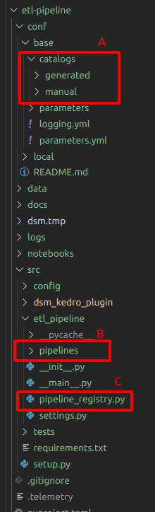
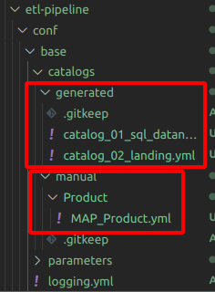
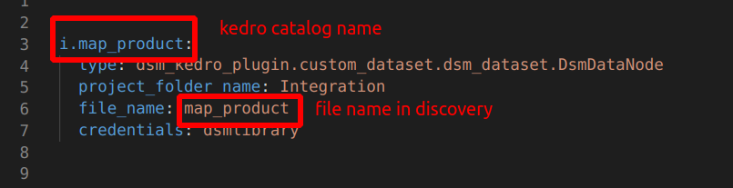
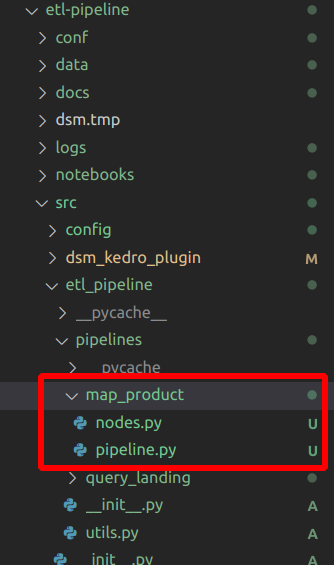
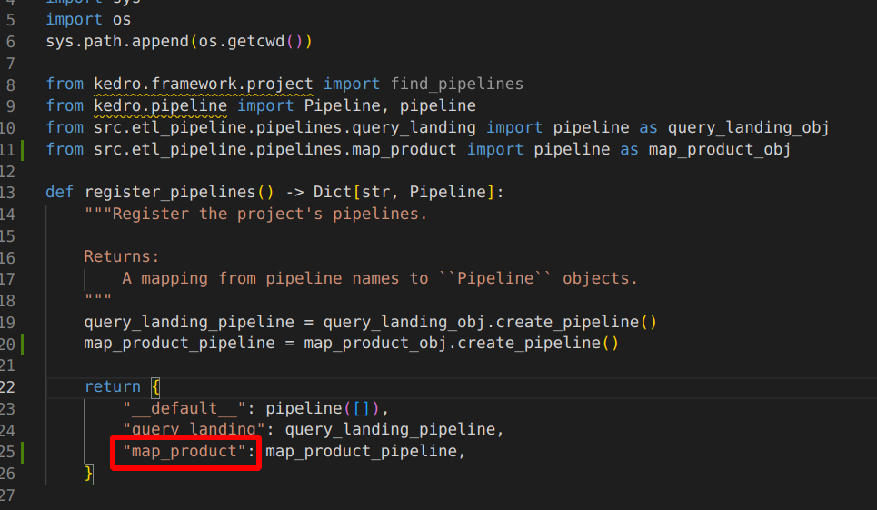
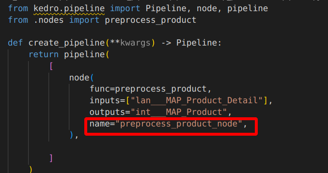

# Overview

## Table of Content

1. [Project Structure](#1-project-structure)
2. [Data Zone in Data Platform](#2-data-zone-in-data-platform)
3. [Name Convention for Data Pipeline](#3-name-convention-for-data-pipeline)
    - 3.1 [Data Catalog for each Data Zone](#31-data-catalog-for-each-data-zone)
        - 3.1.1 [Data Catalog File Path](#311-data-catalog-file-path)
        - 3.1.2 [Data Catalog Name](#312-data-catalog-name)
        - 3.1.3 [File Name in Discovery](#313-file-name-in-discovery)
    - 3.2 [Pipeline Folder](#32-pipeline-folder)
    - 3.3 [Pipeline Registry](#33-pipeline-registry)
    - 3.4 [Kedro Node Name](#34-kedro-node-name)

# 1. Project Structure

- A: **Data Catalogs**, you can define data catalog here, there are two type of data catalog
    -   generated : the landing data that generated from kedro (only for database as data source)
    -   manual : catalog files that you need to create and declare by yourself  
- B: **Pipelines Folder**, your can define node and pipeline object here
- C: **Pipelines Registry File**, you can mapping pipeline name and pipeline folder here 
# 2. Data Zone in Data Platform
- Landing : 
    - store raw data from all data source
- Staging : 
    - store preprocess data
    - store kimball factable of each system
- Integration : 
    - store dimension table
    - store output data that ready to use (Data Product)
    - store integrate all kimball factable to one
# 3. Name Convention for Data Pipeline

## 3.1 Data Catalog for each Data Zone

### 3.1.1 Data Catalog File Path
Base of catalog files are located in `conf/base/catalogs/`

**Guideline Name Table**:  
https://docs.google.com/spreadsheets/d/18FKqrnDu-NohkPI2ejyFjWySgslZh_Xkijdd7XkeccU/edit#gid=10803568

**Example File Name**  

### 3.1.2 Data Catalog Name
#### Definition  
- **APP_NAME** : 3 character that refer to your data source application (if no app name, use EXT for external data)   
- **LANDING_NAME** : It depend on data source  
    - **Database** : use original table name from source database. Original table name can be any string format, not only snake case. The catalog name will be generated from dsm kedro library.
    - **File** : use `file name` in *snake case*
    - **Scraping** :  use `dataset name` in *snake case*
- **DATA_PRODUCT_NAME**: name of data product

**Guideline Name Table**:  
https://docs.google.com/spreadsheets/d/18FKqrnDu-NohkPI2ejyFjWySgslZh_Xkijdd7XkeccU/edit#gid=1486506373

### 3.1.3 File Name in Discovery
**Guideline Name Table**:  
https://docs.google.com/spreadsheets/d/18FKqrnDu-NohkPI2ejyFjWySgslZh_Xkijdd7XkeccU/edit#gid=1434591458

**Example Catalog Name and File Name in Discovery**  

## 3.2 Pipeline Folder 
one pipeline per Data Product (integration file)   
**Guideline Name Table**:  
https://docs.google.com/spreadsheets/d/18FKqrnDu-NohkPI2ejyFjWySgslZh_Xkijdd7XkeccU/edit#gid=637478579

**Example Pipeline Path**  
 

## 3.3 Pipeline Registry 
**Guideline Name Table**:  
https://docs.google.com/spreadsheets/d/18FKqrnDu-NohkPI2ejyFjWySgslZh_Xkijdd7XkeccU/edit#gid=278641671 

**Example Pipeline Registry Name**  
 

## 3.4 Kedro Node Name
use this format `<FUNCTION_NAME>_node`. For example, *preprocess_product_node*
 
